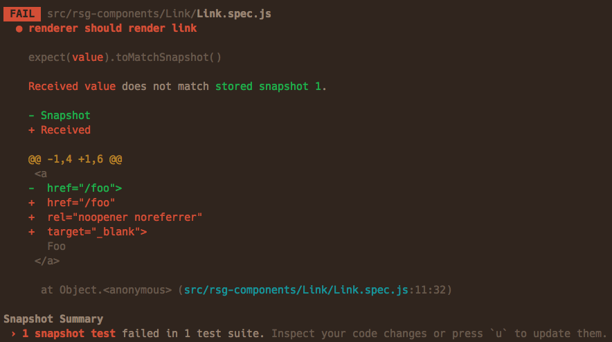

# 使用 Jest 和 Enzyme 测试 React 组件
#### 引言
有人说在通常情况下测试 React 组件是没有太大用处的，但是我觉着在一些场景下是很有必要的：

- 组件库,
- 开源项目,
- 与第三方组件集成,
- bugs, to prevent regressions.

我尝试过很多的工具组合，但是最终如果会推荐给别的开发者，我更乐意去择推荐如下组合：

- [Jest](https://facebook.github.io/jest/), 一个测试框架;
- [Enzyme](http://airbnb.io/enzyme/), React的 测试类库;
- [enzyme-to-json](https://github.com/adriantoine/enzyme-to-json) to convert Enzyme wrappers for Jest snapshot matcher.

我经常在测试中使用的是浅渲染和 Jest 快照测试。



 在 Jest 进行快照测试

#### Shallow rendering

浅渲染指的是将一个组件渲染成虚拟 DOM 对象，但是只渲染第一层，不渲染所有子组件。所以即使你对子组件做了一下改动却不会影响浅渲染的输出结果。或者是引入的子组件中发生了 bug,也不会对父组件的浅渲染结果产生影响。浅渲染是不依赖 DOM 环境的。

举个例子:

```
const ButtonWithIcon = ({icon, children}) => (
    <button><Icon icon={icon} />{children}</button>
);
```

在 React 中将会被渲染成如下:

```
<button>
    <i class="icon icon_coffee"></i>
    Hello Jest!
</button>
```

但是在浅渲染中只会被渲染成如下结果:

```
<button>
    <Icon icon="coffee" />
    Hello Jest!
</button>
```

需要注意的是 Icon 组件并未被渲染出来。

#### 快照测试 

Jest 快照就像那些带有由文本字符组合而成表达窗口和按钮的静态UI：它是存储在文本文件中的组件的渲染输出。

你可以告诉 Jest 哪些组件输出的 UI 不会有意外的改变，那么 Jest 在运行时会将其保存到如下所示的文件中：
```js
exports[`test should render a label 1`] = `
<label
  className="isBlock">
  Hello Jest!
</label>
`;

exports[`test should render a small label 1`] = `
<label
  className="isBlock isSmall">
  Hello Jest!
</label>
`;
```

每次更改组件时，Jest 都会与当前测试的值进行比较并显示差异，并且会在你做出修改是要求你更新快照。

除了测试之外，Jest 将快照存储在 `__snapshots __ / Label.spec.js.snap` 等文件中。

#### 为什么选择 Jest

- 运行速度非常快。
- 可以进行快照测试。
- 在 watch 模式下只会重新测试有过修改的部分。
- fail messages 很有帮助。
- 配置简单。
- Mocks 和 spies 支持.
- 通过命令行可以生成测试报告.
- 发展前景很好。
- Impossible to write silently wrong asserts like expect(foo).to.be.a.function instead of expect(foo).to.be.a(‘function’) in Chai because it’s the only natural thing to write after (correct) expect(foo).to.be.true.

#### 为什么选择 Enzyme

- 便利的工具函数库封装，可以处理浅渲染，静态渲染标记以及DOM渲染。
- jQuery 风格的API，便于使用和直观。

#### 配置


First install all the dependencies including peer dependencies:

第一步安装所有的依赖包括同版本依赖:

```
npm install --save-dev jest react-test-renderer enzyme enzyme-adapter-react-16 enzyme-to-json
```

You’ll also need [babel-jest](https://github.com/facebook/jest/tree/master/packages/babel-jest) for Babel and [ts-jest](https://github.com/kulshekhar/ts-jest) for TypeScript.

你也需要安装 Babel 插件 [babel-jest](https://github.com/facebook/jest/tree/master/packages/babel-jest) 或者 TypeScript 插件 [ts-jest](https://github.com/kulshekhar/ts-jest)

Update your package.json:

更新工程的 package.json 文件:

```
"scripts": {
  "test": "jest",
  "test:watch": "jest --watch",
  "test:coverage": "jest --coverage"
},
"jest": {
  "setupFiles": ["./test/jestsetup.js"],
  "snapshotSerializers": ["enzyme-to-json/serializer"]
}
```

snapshotSerializers allows you to pass Enzyme wrappers directly to Jest’s snapshot matcher, without converting them manually by calling enzyme-to-json’s toJson function.

配置项 'snapshotSerializers' 允许你直接传递 Enzyme 的封装类型 'enzyme-to-json' 到 'Jest' 的快照匹配项中，从而不需要手动进行转化。

Create a test/jestsetup.js file to customize Jest environment (see setupFiles above):

创建一个 test/jestsetup.js 的文件来自定义 Jest 的运行环境（上面的 setupFiles 配置项）

```
import Enzyme, { shallow, render, mount } from 'enzyme';
import Adapter from 'enzyme-adapter-react-16';
// React 16 Enzyme adapter
Enzyme.configure({ adapter: new Adapter() });
// Make Enzyme functions available in all test files without importing
global.shallow = shallow;
global.render = render;
global.mount = mount;
```

For CSS Modules also add to jest section in your package.json:

针对 css 模块也可以添加下面的配置到package.json

```
"jest": {
  "moduleNameMapper": {
    "^.+\\.(css|scss)$": "identity-obj-proxy"
  }
}
```

And run:

同时安装依赖:

```
npm install --save-dev identity-obj-proxy
```

Note that [identity-obj-proxy](https://github.com/keyanzhang/identity-obj-proxy) requires node — harmony-proxies flag for Node 4 and 5.

注意 [identity-obj-proxy](https://github.com/keyanzhang/identity-obj-proxy) 依赖的 node 版本是 Node 4或者 Node 5需要开启 'harmony-proxies'

#### Writing tests

#### 单元测试

#### Testing basic component rendering

#### 测试组件的渲染

That’s enough for most non-interactive components:

对于大部分没有交互的组件，下面的测试用例已经足够:

```
test('render a label', () => {
    const wrapper = shallow(
        <Label>Hello Jest!</Label>
    );
    expect(wrapper).toMatchSnapshot();
});

test('render a small label', () => {
    const wrapper = shallow(
        <Label small>Hello Jest!</Label>
    );
    expect(wrapper).toMatchSnapshot();
});

test('render a grayish label', () => {
    const wrapper = shallow(
        <Label light>Hello Jest!</Label>
    );
    expect(wrapper).toMatchSnapshot();
});
```

#### Testing props

#### Props 测试

Sometimes you want to be more explicit and see real values in tests. In that case use Enzyme API with regular Jest assertions:

有的时候如果你想测试的更精确和看到真实的值。那样的话需要在 Enzyme API 中使用 Jest的 断言。

```
test('render a document title', () => {
    const wrapper = shallow(
        <DocumentTitle title="Events" />
    );
    expect(wrapper.prop('title')).toEqual('Events');
});

test('render a document title and a parent title', () => {
    const wrapper = shallow(
        <DocumentTitle title="Events" parent="Event Radar" />
    );
    expect(wrapper.prop('title')).toEqual('Events — Event Radar');
});
```

In some cases you just can’t use snapshots. For example if you have random IDs or something like that:

有的时候你不能用快照。比如组件里面有随机ID像下面的代码:

```
test('render a popover with a random ID', () => {
    const wrapper = shallow(
        <Popover>Hello Jest!</Popover>
    );
    expect(wrapper.prop('id')).toMatch(/Popover\d+/);
});
```

#### Testing events

#### 事件测试

You can simulate an event like click or change and then compare component to a snapshot:

你可以模拟类似 'click' 或者 'change'这样的事件然后把组件比作一个快照:

```
test('render Markdown in preview mode', () => {
    const wrapper = shallow(
        <MarkdownEditor value="*Hello* Jest!" />
    );

    expect(wrapper).toMatchSnapshot();

    wrapper.find('[name="toggle-preview"]').simulate('click');

    expect(wrapper).toMatchSnapshot();
});
```

Sometimes you want to interact with an element in a child component to test effect in your component. For that you need a proper DOM rendering with Enzyme’s mount method:

有的时候你想要测试一个子组件中一个元素是怎样影响组件的。你需要使用 Enzyme的 mount 方法来渲染一个真实的 DOM。

```
test('open a code editor', () => {
    const wrapper = mount(
        <Playground code={code} />
    );

    expect(wrapper.find('.ReactCodeMirror')).toHaveLength(0);

    wrapper.find('button').simulate('click');

    expect(wrapper.find('.ReactCodeMirror')).toHaveLength(1);
});
```

#### 测试事件处理

类似于在事件测试中，由使用快照测试组件的输出呈现替换为使用Jest的mock函数来测试事件处理程序本身：

```
test('pass a selected value to the onChange handler', () => {
    const value = '2';
    const onChange = jest.fn();
    const wrapper = shallow(
        <Select items={ITEMS} onChange={onChange} />
    );

    expect(wrapper).toMatchSnapshot();

        wrapper.find('select').simulate('change', {
        target: { value },
    });

    expect(onChange).toBeCalledWith(value);
});
```

#### 不仅仅是JSX

Jest使用JSON进行快照测试，因此你可以测试返回JSON的任何函数，方法与测试组件相同：
```
test('accept custom properties', () => {
    const wrapper = shallow(
        <Layout
            flexBasis={0}
            flexGrow={1}
            flexShrink={1}
            flexWrap="wrap"
            justifyContent="flex-end"
            alignContent="center"
            alignItems="center"
        />
    );
    expect(wrapper.prop('style')).toMatchSnapshot();
});
```

#### 调试与故障排除

**调试浅层渲染器输出**

Use Enzyme’s debug method to print shallow renderer’s output:
使用Enzyme的调试方法打印千层渲染器的输出：

```
const wrapper = shallow(/*~*/);
console.log(wrapper.debug());
```

**启用覆盖范围的失败测试**

当你的测试失败时，带有覆盖范围标志的diff如下所示：

```
-<Button
+<Component
```

尝试将箭头函数组件替换为常规函数组建：

```
- export default const Button = ({ children }) => {
+ export default function Button({ children }) {
```

**requestAnimationFrame 错误**

当你运行你的测试时，你可能会看到如下错误：

```
console.error node_modules/fbjs/lib/warning.js:42
  Warning: React depends on requestAnimationFrame. Make sure that you load a polyfill in older browsers. http://fb.me/react-polyfills
```
React 16[依赖于](https://reactjs.org/docs/javascript-environment-requirements.html)`requestAnimationFrame`，因此你需要在你的测试代码中添加一个[polyfill](https://github.com/chrisdickinson/raf)
```
// test/jestsetup.js
import 'raf/polyfill';
```

#### 参考来源

- [Jest cheat sheet](https://github.com/sapegin/jest-cheat-sheet)
- [Testing React Applications](https://youtu.be/59Ndb3YkLKA) by Max Stoiber
- [Migrating to Jest](https://medium.com/@kentcdodds/migrating-to-jest-881f75366e7e#.pc4s5ut6z) by Kent C. Dodds
- [Migrating Ava to Jest](http://browniefed.com/blog/migrating-ava-to-jest/) by Jason Brown


